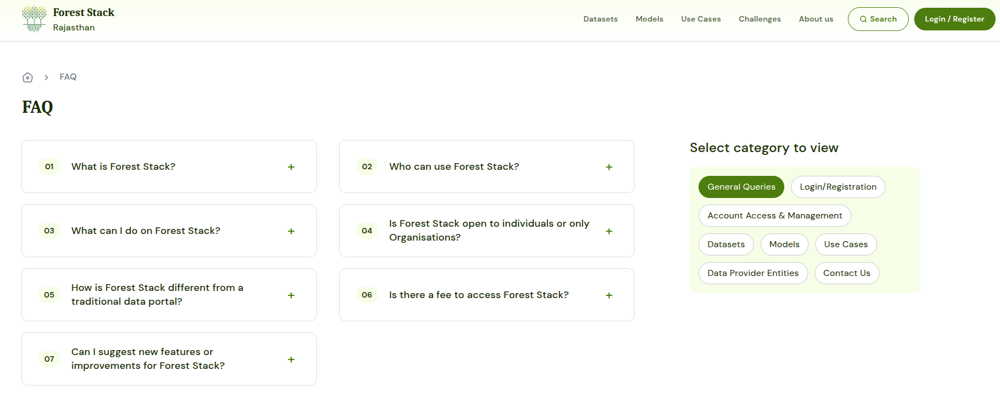

# FAQs

---

The FAQs section provides quick answers to common questions about Forest Stack features. It is organized into the following categories for easy navigation:

- **General Queries**: Overview questions about Forest Stack and its functionality
- **Login/Registration**: Help with account setup, login issues.
- **Account Access & Management**: Guidance on roles, permissions, and user actions
- **Data Sets**: Using, accessing, and contributing to the Dataset.
- **Models**: Questions related to uploading, downloading, and using models.
- **Use cases**: Understanding how use cases are structured and published.
- **Data Provider Entities**: Joining or managing organisations and assigning roles.
- **Contact Us**: Support details for reaching the Forest Stack helpdesk.

*FAQs*

