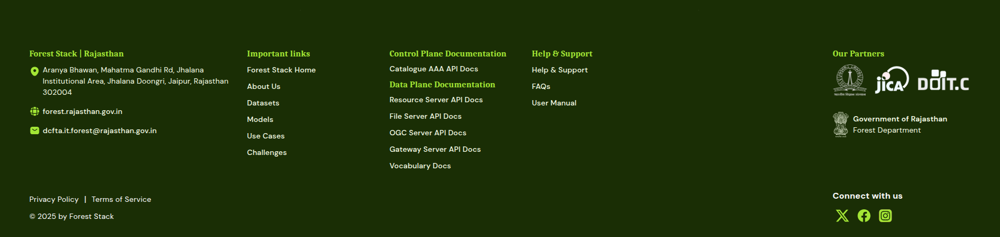

## Call to Action & Footer

At the bottom of the Home Page, a prominent banner prompts users to **Register Now** or **Contact Us**, encouraging them to join the Forest Stack community, explore Data Sets, Models, and Use cases, and start building solutions.

The footer reinforces the platform’s identity with quick navigation links:

- **Forest Stack:** Home, About Us, Contact Us  
- **Platform Features:** Data Set, Models, Use Cases 
- **Help & Support:** Grievance, FAQ, User Manuals

It also includes:
- The Forest Stack logo with a brief description of the platform’s mission
- Social media icons: Facebook, X, Instagram
- Legal links: Privacy Policy and Terms of Service

  
*Call to Action and Footer section*
