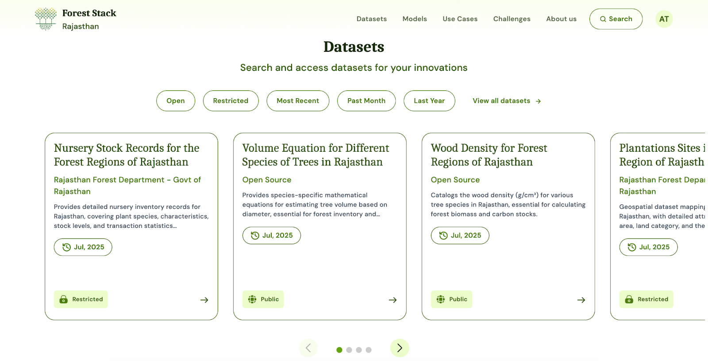
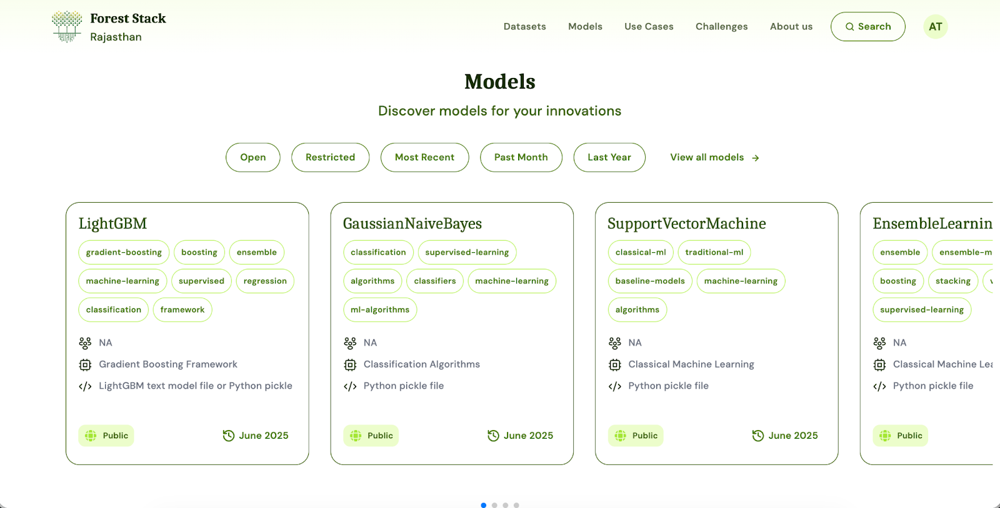
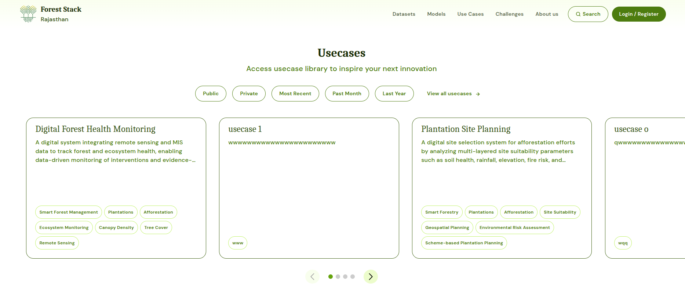

## Core Forest Stack Features

This section introduces the core pillars that power Forest Stack’s data-driven innovation - Datasets, Models , Use cases.
  
*Forest Stack core features Dataset section*

  
*Forest Stack core features Models section*

  
*Forest Stack core features Use Cases section*