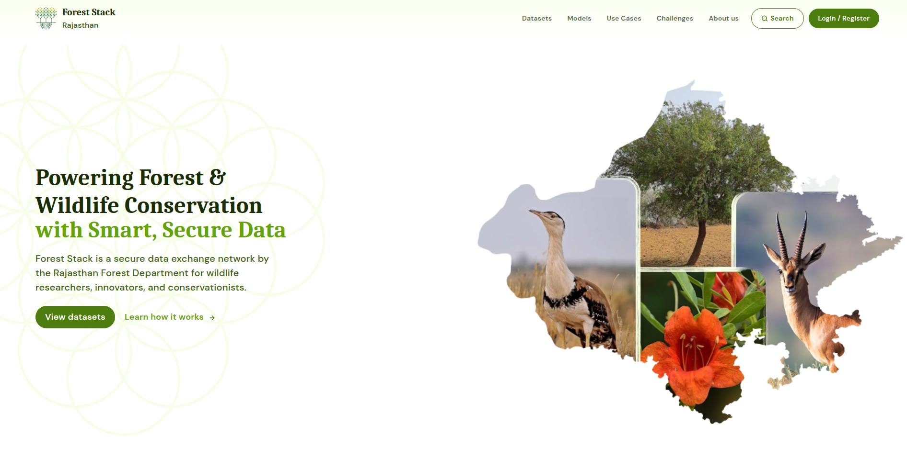

## Hero section and Global search

The Hero section welcomes users with the Forest Stack tagline “Powering Forest & Wildlife Conservation with Smart, Secure Data” — set against a clean background to draw attention to the platform’s core promise. On the top right positioned is the global search bar, where users can enter keywords to discover Datasets, Models and Use cases. As users type, the search suggests matching items grouped by category, and a single click on “a result” delivers a unified results page. This combination of a bold, engaging header and an intelligent, all-in-one search tool ensures users can immediately find and act on the resources they need.
  
*Hero section and Global search bar Section*
