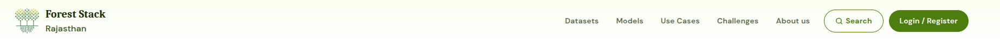

# Navigation Bar

The navigation bar spans the top of every Forest Stack page, providing one-click access to all primary modules and key account actions:

### Forest Stack Logo
Click to return to the Home Page from anywhere in the platform.

### Data Sets
Direct link to browse, search, and filter available Data Sets.

### Models
Takes users to the gallery of pre-trained Models, with options to navigate to the respective github pages and download them.

### Use Cases
Takes users to a gallery of Use cases showcasing real-world use cases to inspire AI innovation.

### About Us
Opens the overview page detailing Forest Stack’s vision and core values.

### Sign in / Register
Initiates the process to log in or create an account and join the Forest Stack community.

### User Icon
Displayed after users log in, the User Icon links directly to their personal dashboard and activity center.

This fully responsive bar adapts to desktop and mobile views, collapsing into a hamburger menu on smaller screens while keeping all items within easy reach.

  
*Pre-Login Navigation Bar*

  
*Post-Login Navigation Bar*
