# Data Sets

Datasets are collections of datasets made available on Forest Stack. These may include information like health records, satellite imagery, public service logs, or other structured/unstructured data that can be used for analysis, research or building AI solutions.

---

### Data Sets Listing Page

The Dataset Listing page offers a consolidated view of all available Datasets, complete with a search bar, sorting options and a collapsible filter panel (by Data Provider Entity type, department, access status and more) to help users pinpoint relevant assets. Each Dataset is presented as a card showing its title, publisher, readiness score, file type, access level and a brief description, with a **View Dataset** button to access full details or download options.

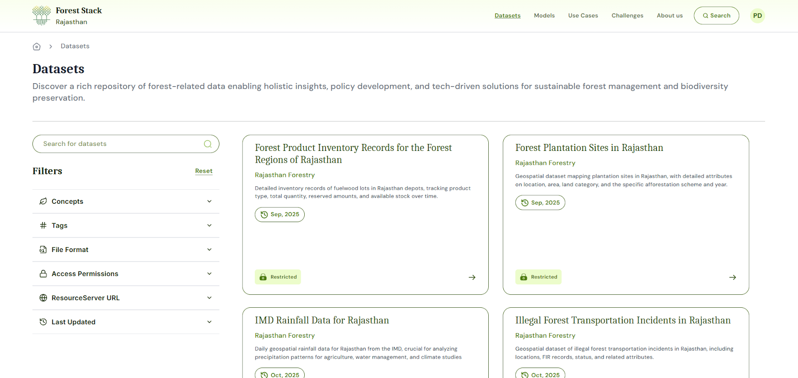
_Data Bank Listing Page_

### Data Sets Search Bar
Positioned at the top of the Dataset Listing page, the search bar lets users enter keywords to quickly locate specific Datasets. As users type, it offers instant suggestions and filters the displayed cards to match titles, descriptions or tags, streamlining the discovery process.
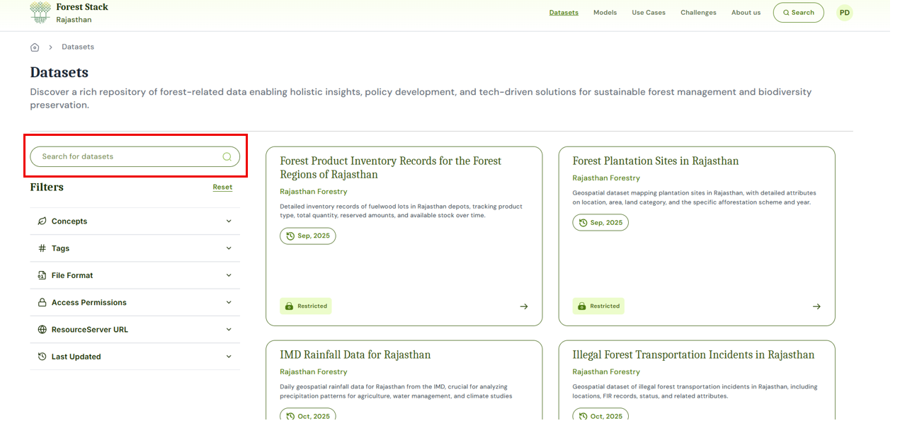
_Data Sets Search Bar_

### Filter Feature
The filter panel is divided into several sections, each allowing users to narrow the Data Set listing according to specific criteria:
- Data Provider Entity Type:
    - All: Includes Data Sets from every source.
    - Public: Data Sets published by government departments or publicly funded entities.
    - Private: Data Sets contributed by private companies or startups.
    - Academic Institution: Data Sets originating from universities and research institutes.
    - Other: Data Sets from NGOs, community groups or any other type of Data Provider Entity.
- Industry: Applying an industry filter limits results to Data Sets tagged under those sectors. Type to search or select one or more industries— such as Healthcare, Financial Services, Agriculture, Manufacturing, Energy, Education and more.
- Access Status:
  - Open: Publicly available Data Sets with immediate download access.
  - Restricted: Data Sets requiring approval or elevated permissions to download.
- File Type: Choose from formats like CSV, PDF, TXT, Shapefile, image files etc. Selecting multiple types returns any Data Set offering at least one of the chosen formats.
- Data Readiness: Use predefined ranges (e.g., 0–20%, 20–40%, 40–60%, 60–80% and greater than 80%) to filter by data readiness and usability of data set to build models. Higher readiness score indicates more fully documented and clean Data Sets.
- Last Updated: Restrict results to data Sets updated in last 7 days, last 30 days, last 1 year or within a custom date range.

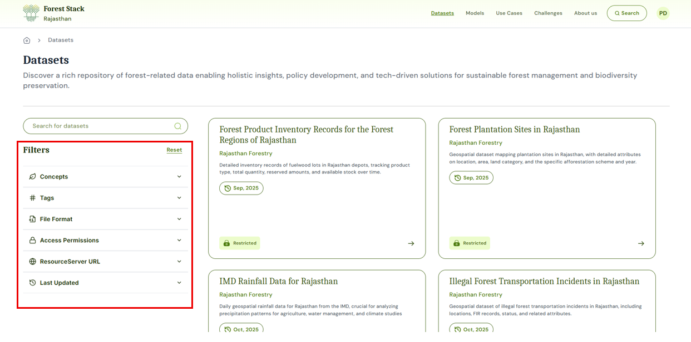
_Filter Feature_

### Data Set Card
Each Data Set card provides a snapshot of key information:
- **Access Status—**"Open" or "Restricted" badge
- **Publishing Data Provider Entity**
- **Title**
- **Short description**
- **Tags**
- **Data Readiness score**
- **File format**
- **Last updated date**
- **Action Button**: "View DataSet” to open the full details and download options.

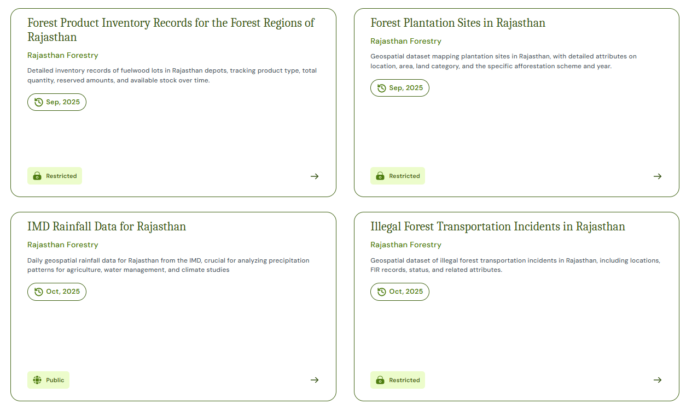
_Data Set Card_

---

## Data Set Details

1. **<u>Metadata:</u>** Each data set comprises a comprehensive metadata panel that describes the asset's origin, usage scope, access rules, and quality indicators. This information helps users assess relevance and technical suitability before downloading or integrating the dataset into their projects.

*Metadata fields shown are:*
- **Title**: Name of the dataset
- **Long description**: The long description section provides an in-depth narrative about the Data Set, offering context that goes beyond the basic metadata fields. It can outline the type of records (e.g., antenatal visit history, diagnostic results, vital signs) and the data sources (such as public health centers or hospitals). It can also suggest potential use cases, ideal audience and indicate on type on possible analyses that can be performed using the dataset.
- **Data Provider Entity**: The government department, agency or entity that has the ownership of the published data set.
- **Industry**: The sector classification such as, healthcare, mobility, etc. that indicates the data set’s primary domain.
- **Uploaded By**: The user or team (or their organisation) that submitted the DataSet to Forest Stack.
- **Geo Coverage**: The geographic extent of the data (e.g., “State-level (Rajasthan)”).
- **Year Range**: The temporal span of the records contained in the data bank (e.g., 2018–2024).
- **Data Bank Permission**: Access level—Open (no restrictions) or Restricted (requires approval)—that governs download and use.
- **Last Updated**: Date and time when the Data Set was most recently refreshed.
- **File Format**: The downloadable format(s) provided (e.g., CSV, TXT, PDF).
- **License**: The legal terms under which the Data Set is made available (e.g., Rajasthan  Open Health Data License v1.0).
- **Upload Frequency**: How often the data set is updated (e.g., Quarterly, Monthly, One-time).
- **Data Readiness**: A data readiness score (percentage) that reflects completeness, documentation and cleanliness of the dataset.
- **Verified By**: The role or individual—typically the Organisation Manager—who reviewed and approved the Data Bank for publication.

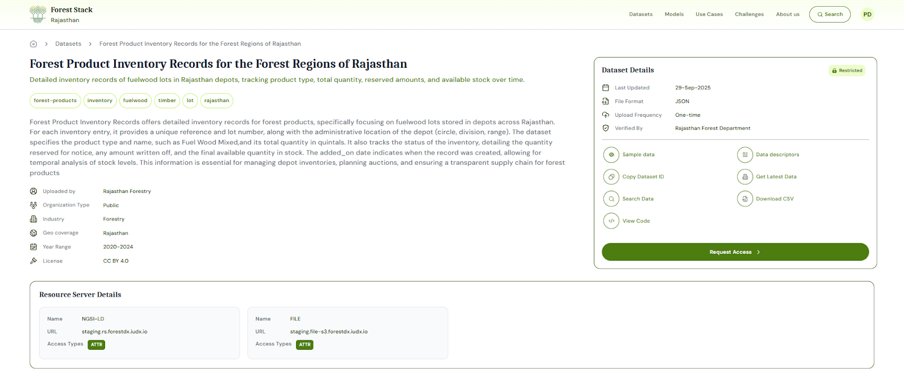
_Dataset Details_

2. **<u>Data Querying:</u>**
- Get Data
- Get Latest Data
- Query Data
- Download Data

---

## Data Set Upload

### Step 1: Click on **Start adding Data Set** and set up your data set:
1. **Enter Title & Permission:**
   - **Data Set Title**: Give your dataset a clear, descriptive name.
   - **Data Set Permission**: Choose from following in the drop-down:
     - Open: Viewable/downloadable by all registered users
     - Restricted: Users can view data Set but downloadable only upon publisher’s approval
     - Private: Data Set is not viewable/ downloadable by anyone, meant for personal use
2. **Choose Metadata Entry Method:**
   - **Enter Metadata Manually:** Click ‘Enter Metadata’ to fill in all fields via the form.
   - **Import from JSON:** Click ‘Upload JSON File’ to upload your metadata using an existing template file

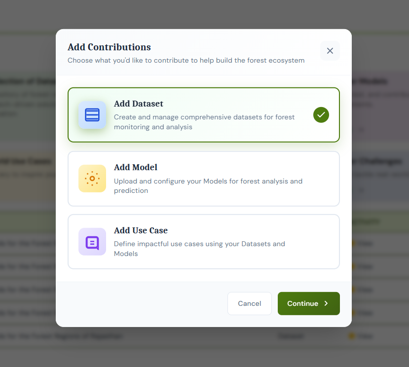
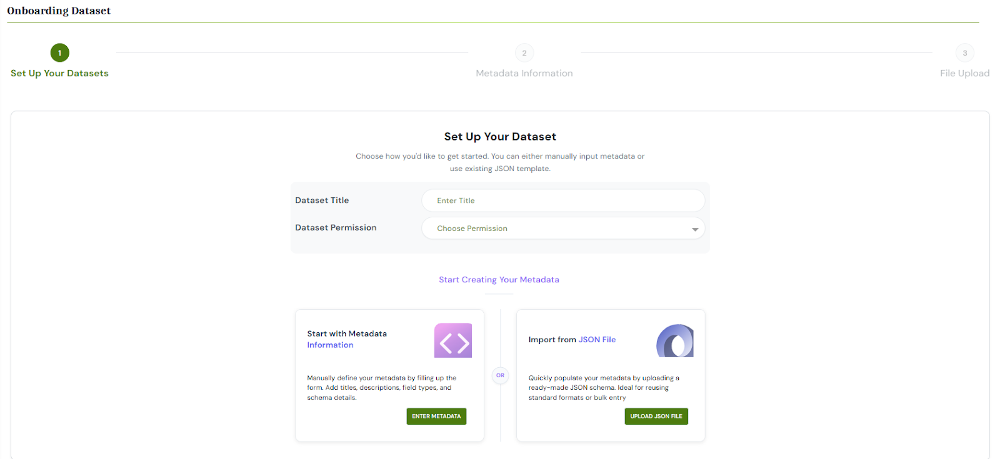
_Set up your dataset_

### Step 2: Enter Metadata Information
1. Under metadata Information, fill out each mandatory field:
   - **Short Description**: A one- or two-sentence summary of the data set’s content and purpose.
   - **Tags**: Add tags (e.g., "Community Health," "Satellite Imagery") to aid discovery.
   - **Long Description**: Provide an in-depth narrative about the Data Set, offering context that goes beyond the basic metadata fields. It can outline the type of records (e.g., antenatal visit history, diagnostic results, vital signs) and the data sources (such as public health centers or hospitals). It can also suggest potential use cases, ideal audience and indicate on type on possible analyses that can be performed using the data set.
   - **Data Provider Entity**: The government department, agency or entity that has the ownership of the published data set.
   - **Industry**: The sector classification such as, healthcare, mobility etc. that indicates the data bank’s primary domain.
   - **Year Range**: The temporal span of the records contained in the data bank (e.g., 2018–2024).
   - **Data Set Type**: Choose from catalogued types – structured/semi-structured/unstructured.
   - **Uploaded By**: Autofilled using your existing details.
   - **Upload Frequency**: How often the data will be updated (Daily, Weekly, Monthly, Annually, One-time).
   - **Geo Coverage**: Geographic extent (e.g., State-level Rajasthan).
   - **License**: Legal terms governing reuse.
   - **Organisation Type**: Public, Private, Academic, or Other
   - **File Format**: Format of data bank file which is being uploaded (CSV, TXT, PDF, GeoJSON, Shapefile, etc.).
2. **Link Related Assets**: Add Associated Data Sets or Add Associated Models to create pre-defined connections between your new Data Set and other platform content.
 
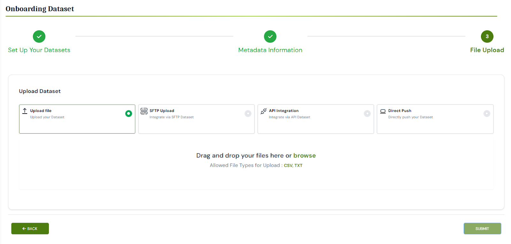
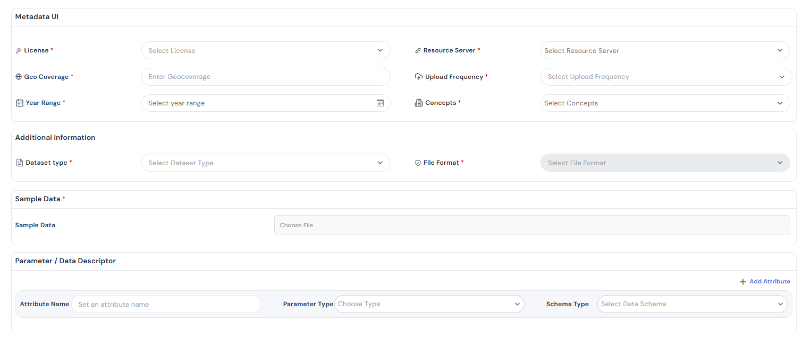
_Adding metadata information_

### Step 3: Upload Data Set
The user should upload the relevant files according to the file format selected in Step 2. Users can upload multiple files using the "Upload More" button. Additionally, users can clear or delete any previously uploaded files and upload new files or an entirely new set using the **Clear All** button.

### Step 4: Review and Publish
After your files finish uploading, you’ll be taken to a summary page displaying all metadata fields and tags you entered, list of uploaded files and their preview (if uploaded data is structured). Carefully verify each detail—move back to the respective section to correct any information. When everything looks correct, click Publish.

### Step 5: Approval
Approval requests are sent to the Organisation Manager for review. Once they approve, the data set gets published on the Forest Stack Data Set listing page.

---

## Data Set Download

Depending on a Data Set's permission level, the steps to download differ slightly:

- **Open Data Sets:**
  1. Click the **Download** button on the data set details page.
  2. The entire Data Bank (all files and folders) is packaged into a single ZIP archive and begins downloading immediately
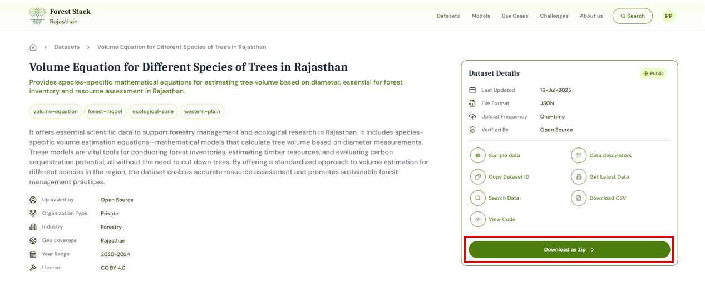
_Downloading Open Datasets_

- **Restricted Data Sets:**
  1. Click the **Request Access** button on the data bank details page
  2. A request form pops up; add a brief justification for why you need access.
  3. Submit the request—Forest Stack notifies the data set's publisher
  4. Once approved, you'll receive an email notification, and a **Download** button appears in the details page.
  5. Click **Download** to retrieve the full Data Set.
  
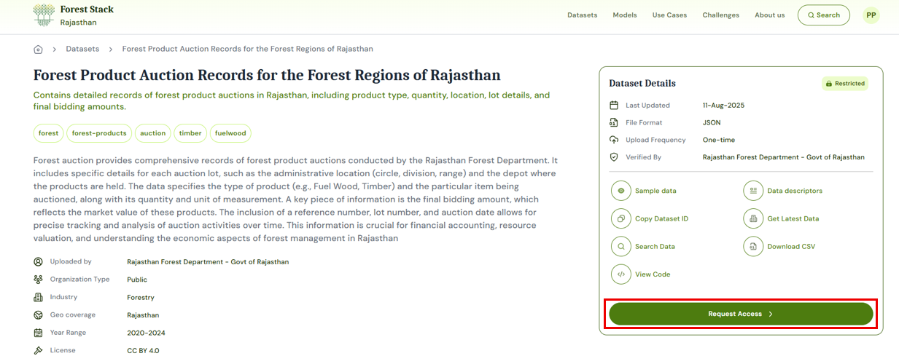
_Downloading Restricted Data Sets_

---
