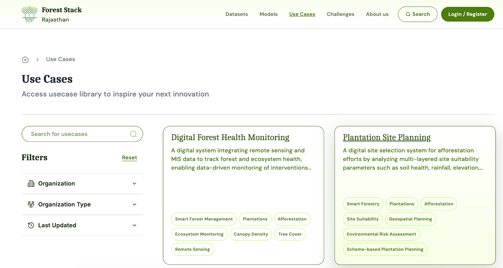
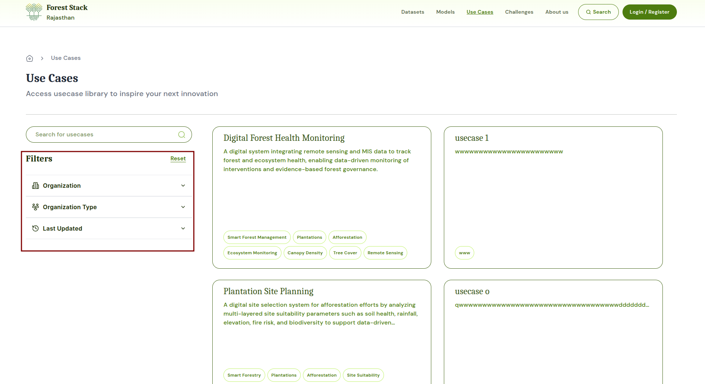
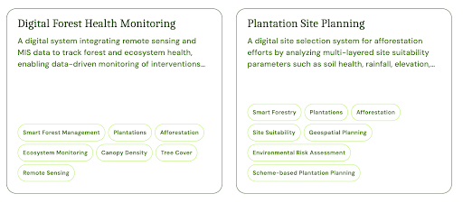
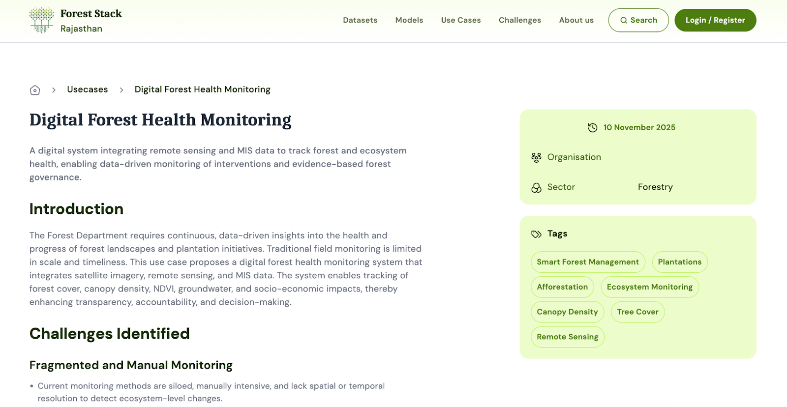
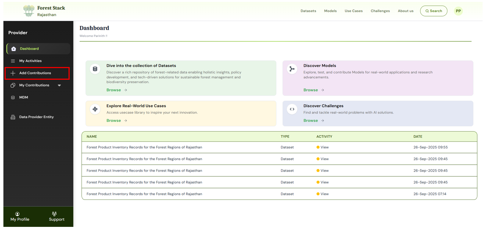
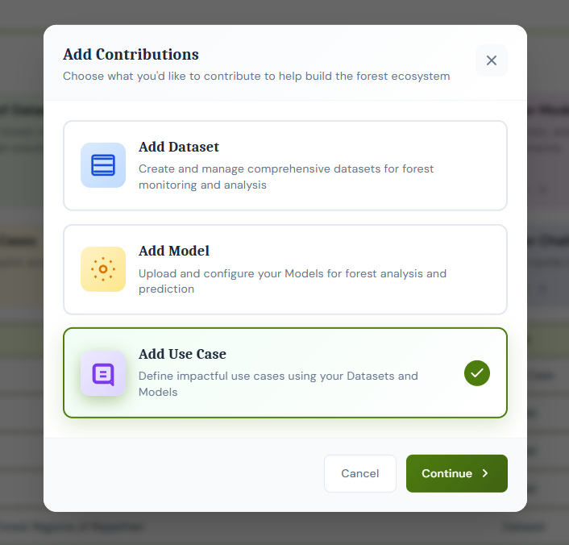
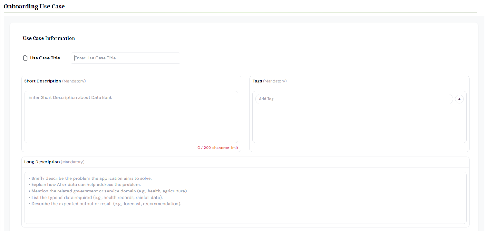
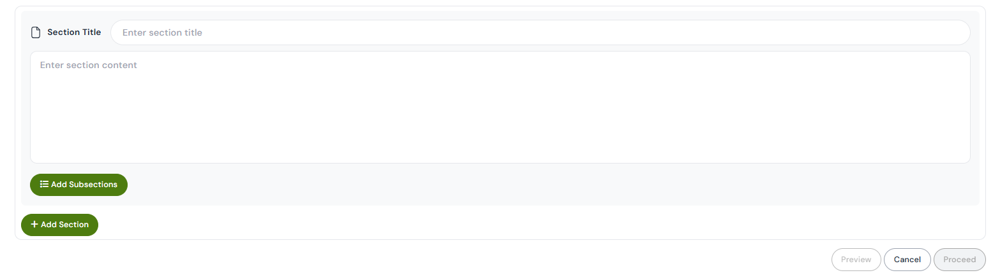

# Use cases

Use cases are real-world problem statements paired with possible AI-based solutions. Some include working examples built using Forest Stack resources, while others are open challenges shared to inspire new ideas and innovations.

---

## Use cases Listing Page

The Use cases listing page provides users with access to a curated collection of AI-driven solution ideas and real-world implementations. It includes the following features:

- **Search Bar**: Located at the top, allows users to search for applications by keywords such as "chatbot", "health", or "transport".
  

- **Filter Panel**:
  - **Organisation**: Narrow results based on a specific organisation.
  - **Organisation Type**: Filter applications by the type of contributing organisation (Public, Private, Academic, Other)
  - **Last Updated**: Apply filters to see applications recently added or modified.

- **Use case Cards**: Each card displays:
  - Title
  - Publishing Data Provider Entity
  - Short Description
  - Tags
  - Last Updated date
  - "View Use case" button to explore full details

## Use Case Detail Page

The Use cases Detail Page provides an in-depth view of a specific AI-driven solution or idea. It is designed to help users understand the problem being addressed, the AI approach used, and the practical impact the application can have. In some cases, it may also present an open problem statement—offering inspiration for users to explore and develop new AI-based solutions using available Data Banks and AI Models on the platform.

- **Title & Publisher**: Displays the name of the Use case and the department or Data Provider Entity that published it.
- **Tags**: Keywords related to the particular use case to increase discoverability.
- **Description**:
  - The description section of a Use case gives a simple and clear explanation of the real-world problem it aims to solve and how AI helps in addressing it. It also explains how and where the solution can be applied—for example, in health centres, government services, or agriculture.
  - It includes details on the data used, AI models leveraged and how the solution is deployed, like through a mobile app or tablet used by field workers.
  - Finally, the section highlights the benefits the application offers.

- **Associated Data Banks and AI Models**: Option/link to view the associated data sets or pre-trained AI models leveraged for solving the focused problem.

---

## Use case Upload

### Step 1: Enter Potential Application Information
Click on **Start Adding Use Case** and start entering use case information - In this step, users provide a complete overview of the use case, including:
- **Title**: A clear and concise name for the application
- **Short Description**: A brief summary describing the nature of the problem or use case and what the application aims to achieve.
- **Tags**: Keywords related to the domain, solution, or technologies involved.
- **Long Description**: The long description should provide a clear and detailed explanation of the application. It should describe the specific problem being addressed and explain how AI or data can help solve it. It should also mention the relevant domain or department the solution applies to. Additionally, the description should include the type of data or model used in the solution.
- **Organisation Type**: Select whether the contributor is from a public, private, academic, NGO/non-profit or other type of organisation.
- **Industry**: Sector classification of the problem being solved
- **Add Associated Assets**: Link relevant data sets/Models already published on Forest Stack that were utilized or can be utilized to solve the problem

_Clicking on Start adding use case_

-

_Use Case upload form_

### Step 2: Review and Publish
- This final step provides a preview of the complete submission. Users should review all fields including title, descriptions, tags, and associated assets.
- Make any necessary edits before finalising.
- Click Publish to submit the Use case.

### Step 3: Approval
Approval requests are sent to the Organisation Manager for review. Once they approve, the Use case gets published on the Use cases listing page.

---