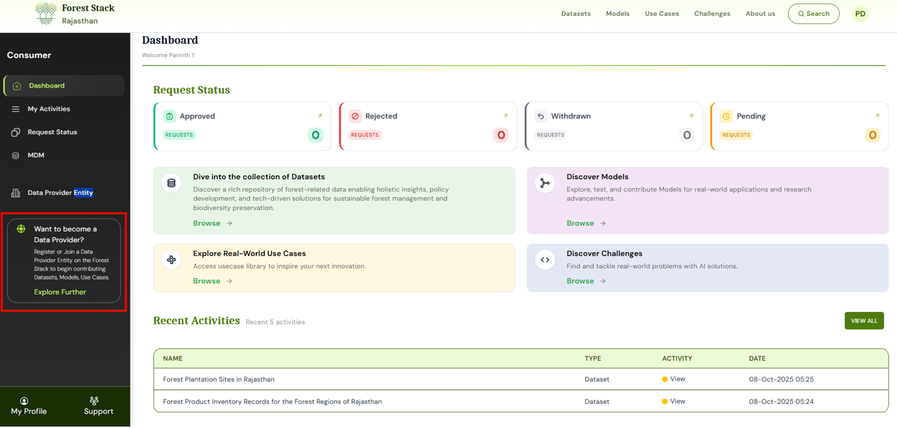
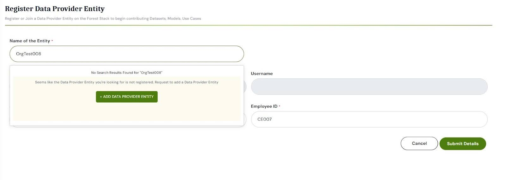
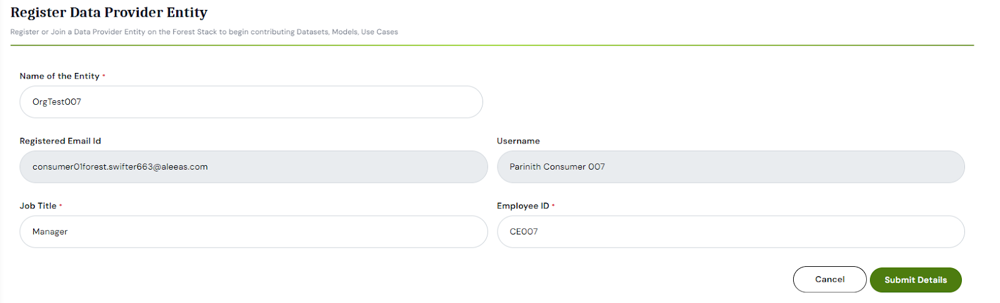

If a user’s Data Provider Entity isn’t yet registered on Forest Stack, the user can submit a request to add it by providing Data Provider Entity details and supporting documents. Only a person authorized by that Data Provider Entity may complete this step, since they will assume the sole **Organization Manager** role. As Organization Manager, the user will have responsibility for adding and managing members, assigning publisher roles, and overseeing all assets published under the Data Provider Entity’s name. Once the Data Provider Entity is approved and the user designated as its manager, no additional Organization Manager accounts can be created for that Data Provider Entity.

Following are the steps to join an already registered organization on the platform.

**Step 1:** Click on the **Join a Data Provider Entity** button on your dashboard.  
  
*Accessing Join Data Provider Entity Option from the dashboard*

**Step 2:** Search for your Data Provider Entity. If no match is found, the system will prompt you with an Add Data Provider Entity option. Click it to begin the registration process. 
  
*Option to Add Data Provider Entity when not found in search*

**Step 3:** You will be redirected to the Data Provider Entity Registration form. It includes three sections:  
1. **Organisation Manager Details:** Fill your profile (Name, Data Provider Entity email, etc.)
2. **Enter Data Provider Entity Details:** Fill in entity type, sector, name, website, and address.
3. **Upload Data Provider Entity Documents:** Upload required files such as, Firm Incorporation Certificate, PAN Card of the Data Provider Entity, Authorization document (stating that user is authorized by their organisation to become Organisation Manager on Forest Stack and manager users and assets on behalf of the Data Provider Entity), Any other supporting document (optional)
  
*Selecting Your Data Provider Entity*

[//]: # (// add three images here)

**Step 4:** Once the form is completed and documents uploaded, click Submit Details.

**Step 5:** A confirmation popup will appear indicating that the request has been successfully sent to the Forest Stack Platform Administrator for review. 
  
*Entering Job Title and Employee ID*

After the request is reviewed and approved, the user will be assigned the Organisation Manager role and can begin managing users and assets under the new Data Provider Entity.