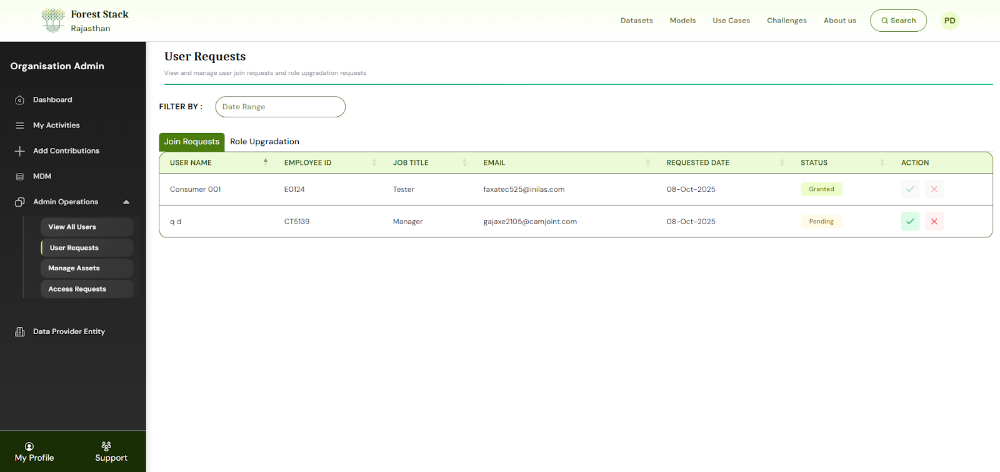
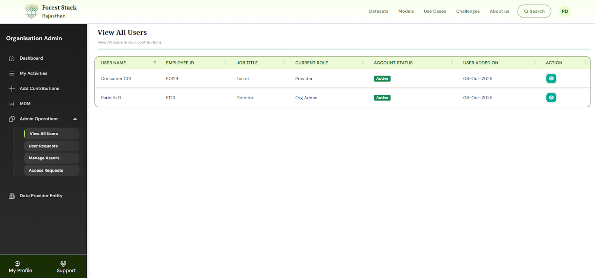
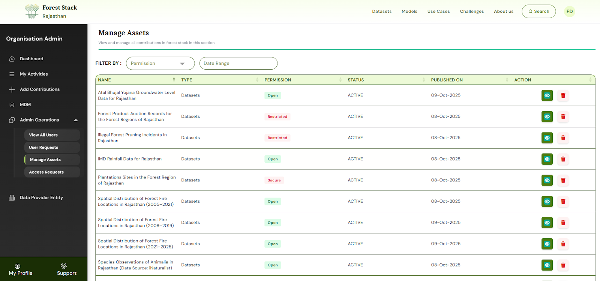
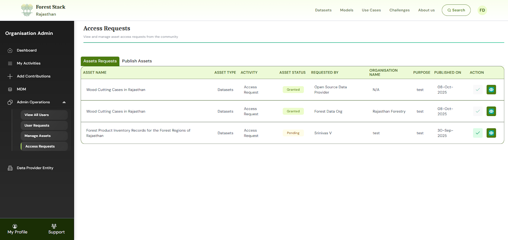

# Organisation Manager

---

## Core Functions

Organisation Managers hold administrative control for their organisation’s presence on Forest Stack. They are responsible for:
- Managing the organisation’s user base (add/remove users, assign roles)

_Manage Users Section_

_User Requests Section_

- Reviewing and approving asset access requests (asset download requests/asset  publication requests/role upgradation requests)

_Manage Assets Section_

_Asset Requests Section_

- Maintaining the organisation profile and ensuring compliance with Forest Stack policies.
