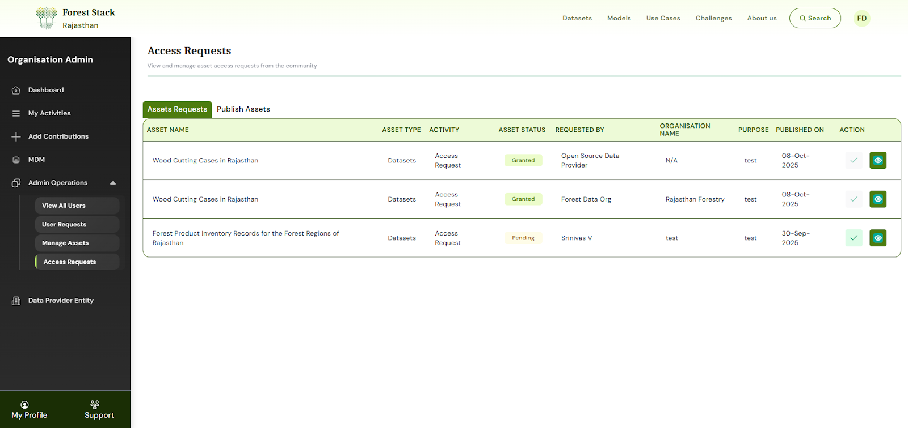
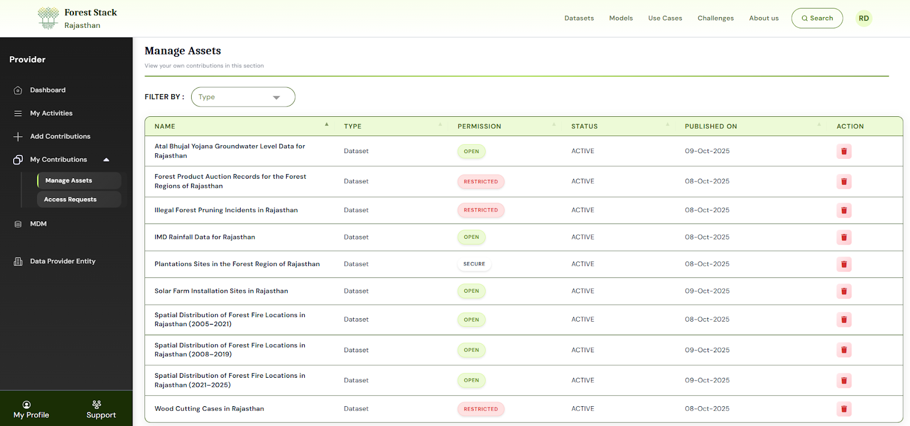

# Publisher / Publisher with Compute

---

## Additional Access and Permissions

Publishers can:
- Publishers can contribute assets to the platform, including Datasets, Models , and Use cases.
---

## Additional Publisher-specific Screens

- Option to upload new assets (Datasets/Models /Use cases) on platform.
- Manage uploaded assets.

- Approve requests from users to download your assets

