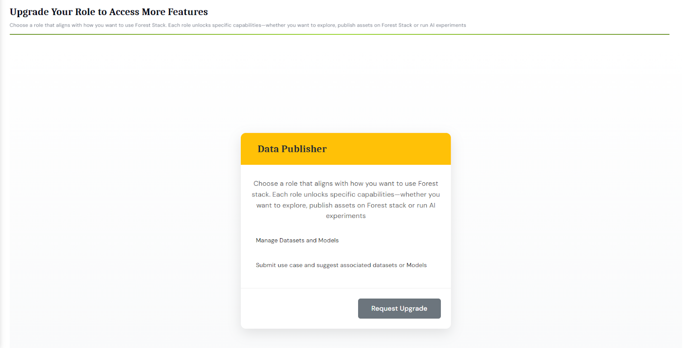

# Role Upgradation Process

---

## Steps to Upgrade Your Role

1. Users start as Consumers by default. To upgrade their role:
   - Users need to join an existing organisation or request to register a new organisation (if not listed). This is a mandatory requirement to become a publisher.
2. **Request Role Upgrade**
   - After completing the above, request a role upgrade from your profile section
3. **Approval**
   - Upon approval, they may be assigned the role of Publisher based on the approval provided:

   
   _Role Up gradation Screen_