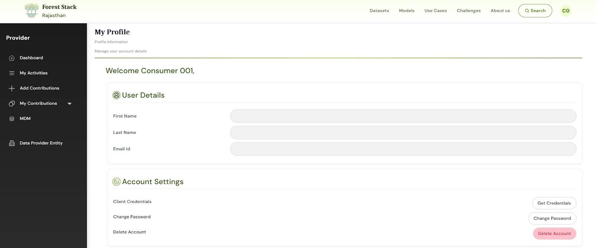

# User Profile Management

---

The **My Profile** section allows users to manage their personal information, account settings, and platform consents. This screen helps users stay in control of their Forest Stack identity and preferences. Key sections include:

### <u>User Details</u>
- Displays basic profile information:
  - Full Name
  - Username
  - Email ID
  - Phone Number
- Edit these fields by clicking **Edit Profile** (top right) and save with **Save Changes**

### <u>Socials</u>
- Link your social media or professional accounts (Twitter, LinkedIn, GitHub)
- These fields are optional and can help enhance profile visibility, especially for contributors.

### <u>Account Settings</u>
- Manage API Key creation for integrating Forest Stack programmatically
- Change Password for account security
- Delete Account to permanently remove the user from Forest Stack.
  - Publisher with compute/organization manager, users have an option to transfer ownership of their uploaded assets before deleting their account.

### <u>Consent Management</u>
- Tracks user agreements for:
  - **Privacy Policy Consent**: View or revoke consent for personal data processing
  - **Terms of Service Consent**: View or revoke agreement to the platform's terms

> Users should regularly visit this section to keep their profile updated, manage their access, and ensure continued compliance with Forest Stack policies.

My Profile Section